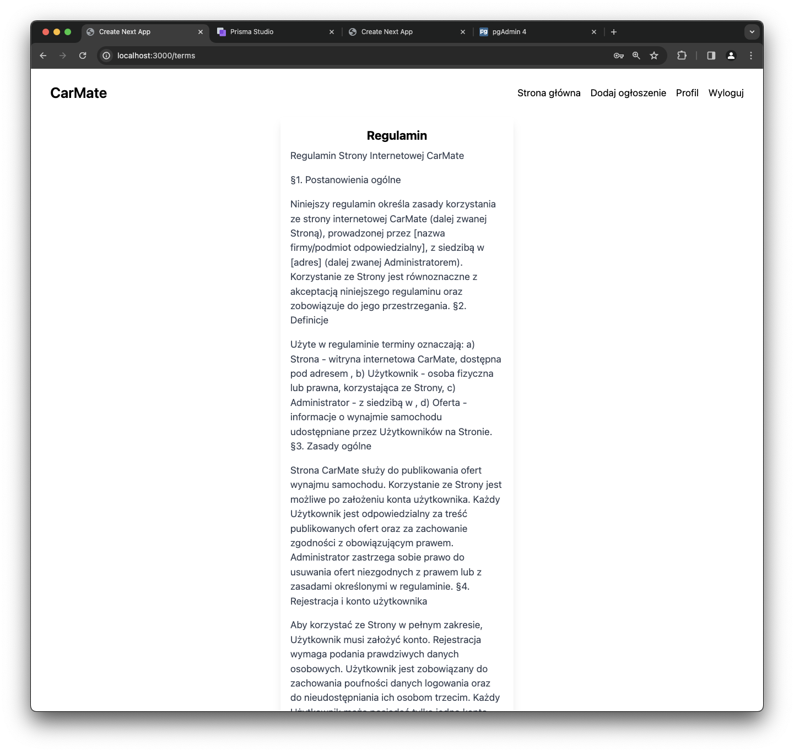

# CarMate

## Cel projektu:

Celem projektu było stworzenie aplikacji pozwalającej uzytkownikom dodawanie oraz przeglądanie ogłoszeń dotyczących wynajmu pojazdów.

## Funkcjonalności:

- logowanie
- rejestracja
- wylogowywanie
- przeglądanie ogłoszeń
- wyświetlanie ogłoszenia
- wyszukiwanie ogłoszeń
- dodawanie ogłoszeń

## Diagram ERD Bazy

## Figma

[Link FIGMA](https://www.figma.com/file/tK30FC4XitTO8eHh2NIADf/AutoMate?type=design&node-id=0%3A1&mode=design&t=COMCQzptgoD1hKS1-1)

## Swagger

## Przykład Działania:

#### Do rejestracji użytkownik potrzebuje podać imie, nazwisko, adres email, hasło, numer telefonu, miasto oraz adres. Wszystkie pola muszą być wypełnione, aby rejestracja przebiegła pomyślnie.

#### Użytkownik może się też zalogować na już istniejące konto.

#### Po zalogowaniu użytkonik zostaje przeniesiony na stronę głowną 

#### Na stronie głownej użytkownik może przeglądać dodane ogłoszenia, dodać swoje ogłoszenie lub wyszukać interesującego go modelu przy użyciu wyszukiwarki

#### Wyszukiwanie:

#### Użytkownik po kliknięciu w interesujące go ogłoszenie zostaje przeniesiony do strony z informacjami o danym pojeździe takimi jak: zdjęcia pojazdu, informacje o właścicielu, opis

#### Użytkownik może nacisnąć przycisk "Umów jazdę próbną" po czym wyświetlą mu się informacje kontaktowe do właściciela

#### Dodanie pojazdu następuje po uzupełnieniu przez użytkownika takich informacji jak: zdjęcie głowne ogłaszanego pojazdu, zdjęcia dodatkowe, nazwę pojazdu, miasto w którym oferowany jest najem oraz opis

#### Aplikacja posiada również takie podstrony jak regulamin, kontakt czy polityka prywatności strony

#### Po skorzystaniu z usług aplikacji użytkownik może się wylogować

#### Aplikacja jest dostosowana do używania jej na komputerach, tabletach oraz telefonach komórkowych

## Rozwój projektu w przyszłości

- Umożliwienie komunikacji pomiędzy osobą dodającą ogłoszenie i przeglądającą
- Dodanie możliwości zarezerwowania terminu wypożyczenia pojazdu bezpośrednio w aplikacji
- Dodanie możliwości moderowania ogłoszeń przez osobę uprawnioną
- Dodanie profili użytkowników

